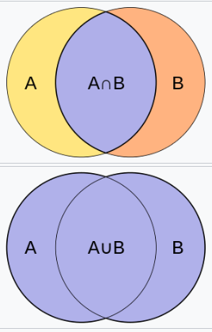

# minedatabase
Github: <https://doi.org/10.1186/s13321-015-0087-1>  
Documantation: <https://mine-database.readthedocs.io/en/develop/index.html>

## general information

### Tanimoto coefficient (Jaccard index)
The Jaccard coefficient measures similarity between finite sample sets, and is defined as the size of the intersection divided by the size of the union of the sample sets:

$$Tanimoto coefficient = Jaccard distance = 1 - Jaccard coefficient$$

## filters
### Tanimoto Threshold Filters

### Tanimoto Sampling Filters

### Metabolomics Filters

## Rules
SMIRKS = represent reactions in a string