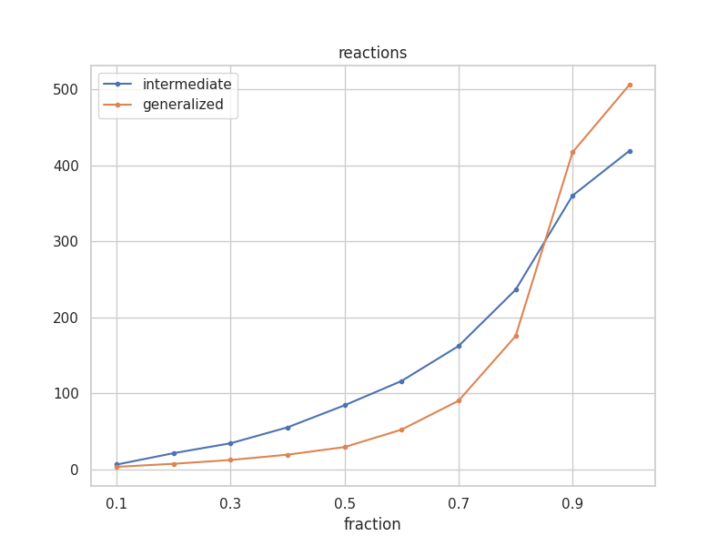
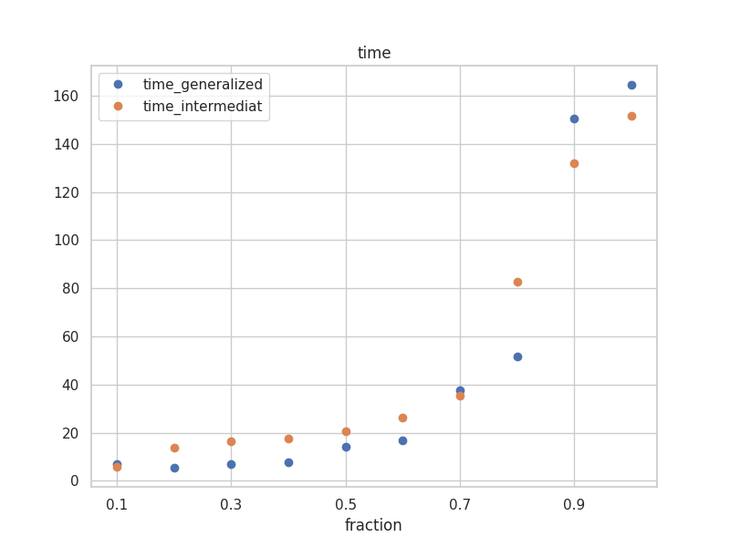

# minedatabase
Github: <https://doi.org/10.1186/s13321-015-0087-1>  
Documantation: <https://mine-database.readthedocs.io/en/develop/index.html>

## general information
The minedatabase is build with rules and adducts. The main idea is to give some compounds and expand them with the given rules (generalized or intermediat). This result can be filtered with different filters or directly saved in a database (mongodb) or in a csv file. 

The generalized rules are 1224 (JN1224min), which should expand the most out of it. This also showed some testruns from us.
We used different fractions of the generealized and indermediate rules and checked the amount of reactions and compounds of the output.  

What we can conclude with the pictures above, that the time goes up with more reactions / compounds / rules. The generelized will produce at +- 0.7 more compounds, at +- 0.8 more reactions and at +- 0.8 more rules.
The time is a little bit difficult to interpret. But it seems like, that it's more independant of the reactions than of the compounds.  
The rules from the two sets share some rules between and others are different.

### Tanimoto coefficient (Jaccard index)
The Jaccard coefficient measures similarity between finite sample sets, and is defined as the size of the intersection divided by the size of the union of the sample sets:

$$Tanimoto coefficient = Jaccard distance = 1 - Jaccard coefficient$$

## filters
### Tanimoto Threshold Filters

### Tanimoto Sampling Filters

### Metabolomics Filters

## Rules
SMIRKS = represent reactions in a string

## 