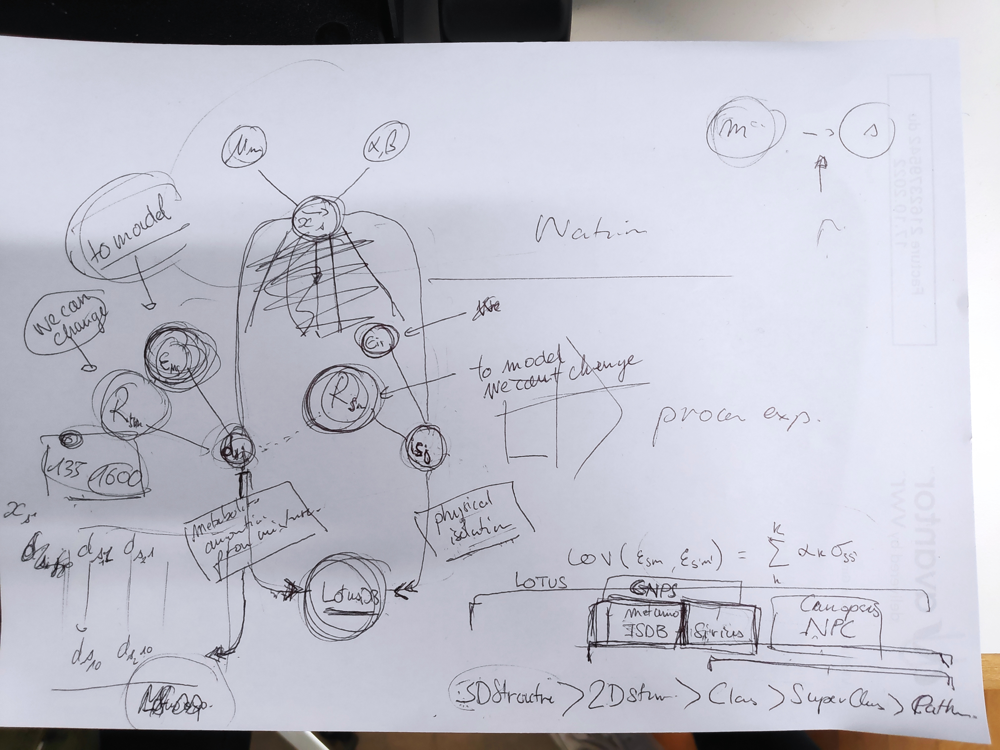

# This is Marco's daily open-notebook.

Today is 2023.02.14

## Todo today
* still publish PDF online because images and DAGs don't work.
* change DAG to split MS data and lotus

###
###

## Doing
* Trying to create multiple DAG and see which one is correct for our model.

## Paused

## Done
* Used `pandoc` to convert latex file into markdown and then passed it into 

Discussion with Pierre-Marie about the structure of MS and what could be used to implement the model. 

We shouldn't forget that our model will likely not be on a 3D molecular level but a 2D since mass spec is not able to make the difference between enantiomers. 
 
## Notes
Sirius and ISDB = info to molecular level 
CANOPUS info to NPC (NP classifier class)

* $y_{sm}$ is the probability of having a molecule in a species
* $\mu_{m}$ is the average presence of *one molecule* across all species. 
* $y_{sm}$ is then the average presence across all species *plus* an error $\epsilon$. And that is why we assume that **error** is normally distributed across the mean $\mu$.
## Todo tomorrow

###
###
###

## Today I learned that

- 