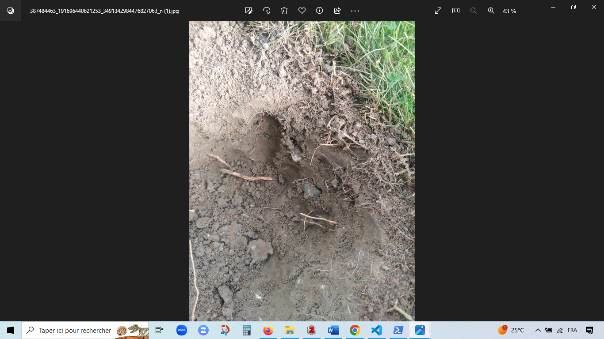

# This is Rimas's COMMONS Lab daily Open Notebook.

Today is 2023.10.11

## Todo today
Getting started with Dandron with PMA

### Have a look at the COMMONS research discussion forum
    - https://github.com/orgs/commons-research/discussions

### Daily work on the Microcosmics project

See [[projects.commons-public.microcosmics]]

### Lab work 

09-10-23

I carried out the first sampling at the botanical garden. I took a horizon of 3- 12 cm.
See pic [[]]
[[]]
[[]]

10-10-2023 Check the inoculated plates.  

Look pic [[]]
[[]]
[[]]
[[]]

###

## Doing

Working on the eerimental design off the roject.
Collecting infos and pdf and woring at [[projects.commons-public.microcosmics.experimental-design]]. 

## Paused

## Done

How to write note in Dendron and to sync with public commons web.

## Notes

## Todo tomorrow, one day ... or never 

###
###

## Today I learned that

- using ctrl+O+N i can creat a dialy note 
- ctrl+s to save my modification  
- ctrl+L search or create note 
- share picture [[link]]
ctrl+shift+P show pallette

#### Setting up of the Microcosmics project 

### Literature 

_Useful before setting up the microcosmis system_
 
 ## Microcosm incubation
12-h photoperiod: Columbia View orchard soil was passed through a 4-mm sieve and 100 g samples were placed into 487 mL microcosms (glass jars). Jar lids were perforated to make a 1 cm diameter hole into which a rubber septum was inserted. The experiment consisted of two treatments; ASD amended with rice bran (RB) and a no-carbon input ASD control (ASD-NA), seven time points; day 0, 1, 2, 3, 7, 11, and 15, with four samples per treatment at each incubation duration point. In total, across all treatments and time points, 56 samples analyzed. For the purposes of this study, RB soil amendment treatment was not included as pathogen suppression (e.g., F. oxysporum f. sp. fragariae) was not realized under such conditions (Figure 1). In addition, RB soil incorporation does not yield an anaerobic environment (Mazzola et al., 2018), nor result in amplification of target microbial populations commonly associated with ASD-induced disease suppression, such as Clostridium spp. For the ASD treatment, 1.57 g of RB (equivalent to 20 Mg per ha per 15 cm depth in the field) was homogeneously mixed into soil. Estimated nutrient concentration of RB was C = 47.8%, N = 2.49%, P = 1.53%, K = 1.60%, S = 0.18%, C:N ratio = 19:1, pH = 6.2 (Soiltest Farm Consultants, Inc., Moses Lake, WA, United States). For both treatments, 25 mL of distilled water was added to saturate the soil pore spaces. The headspace volume over the microcosms was 409 mL. Jars were incubated in an environmental growth chamber for 15 days at 24/18°C with 12-h photoperiod. Photosynthetically active radiation (PAR, 400–700 nm) just above the jars was 226 μmol m–2 sec–2. Immediately after initiating the experiment, headspace volatiles were extracted, and a representative soil sample was collected using a #3 cork borer (7 cores from each microcosm). Soil samples were placed in a chilled sample cup, followed by immediate immersion in liquid nitrogen and stored at −80°C. This procedure was followed for soil sampling at all incubation duration points. Frozen soil cores were cryogenically milled to a fine powder and stored again at −80°C before use for metabolite analysis. For day 0 and day 1 time points, headspace O2 and CO2 composition was analyzed every 4 h and once for the remaining incubation duration points as described below (https://www.frontiersin.org/articles/10.3389/fmicb.2019.02365/full).

## C/MS analysis ( soil metabolomics)
Extraction of the metabolome and LC-MS analysis:
Method 1. Extracellular metabolites were extracted from 2 g of wet soil from each sample (with five technical replicates) using 10 ml of deionized water. The samples were shaken on a mechanical shaker for 12 hours at 4°C, then centrifuged at 2,500 x g for 15 minutes at 4°C, and finally filtered through 0.2 µm polyethersulfone membrane filters (Pall Corporation, New York, NY, USA). Polar metabolites were completely dried using a rapid vacuum concentrator, then chemically derivatized and analyzed by gas chromatography-mass spectrometry (GC-MS) (https://www.mdpi.com/2076-2607/10/8/1653].

Method 2. Biocrust soil water samples (1.5 mL) were lyophilized and resuspended in methanol (200 μL) containing internal standards (2–10 μg/mL) and filtered through 96-well Millipore filter plates (0.2 μm PVDF) by centrifuging at 1500 × g for 2 min. Samples were analyzed using normal-phase LC/MS with a ZIC-pHILIC column (150 × 2.1 mm, 3.5 μm 200 Å, Merck Sequant, Darmstadt, Germany) using an Agilent 1290 series UHPLC (Agilent Technologies, Santa Clara, California, USA)(https://www.nature.com/articles/s41467-017-02356-9).

Method 3. (Soil non-targeted metabolomic detection and analysis) Twelve rhizosphere soil samples were sent to Majorbio (Shanghai, China) on dry ice for metabolite extraction, detection, and analysis. In detail, 1,000-mg soil aliquot of each sample was homogenized with 1,000 µL methanol/water (4:1, v/v) solution, including 0.02 mg/mL internal standard (L-2-chlorophenylamine acid) for 6 min at −10 °C and 50 kHz using a Geno-grinder 2,000 (SPEX, Metuchen, NJ, USA) and spun down for 30 min at 5 °C and 40 kHz. After resting for 30 min at −20 °C, each material was centrifuged at 13,000 g (relative centrifugal force) for 15 min at 4 °C, then the supernatant was transferred and concentrated by a Termovap Sample Concentrator (DC-24, Anpel Laboratory Technologies, Shanghai, China). The dry residue was derivatized by adding 50 µL acetonitrile/water (1:1), homogenized for 30 s at 5 °C and 40 kHz, and centrifuged at 13,000 g (relative centrifugal force) for 10 min at 4 °C. Finally, the supernatant was subjected to LC-tandem MS (MS/MS) analysis; 20 µL supernatant of each sample was mixed for the quality control sample.
The UHPLC-Triple TOF system (AB Sciex, Foster City, CA, USA) equipped with an ACQUITY UPLC HSS T3 (100 mm × 2.1 mm i.d., 1.8 µm; Waters, Milford, CT, USA) was applied to chromatographic separating the metabolites with two mobile phases, phase A (95% water and 5% acetonitrile (with 0.1% formic acid)) and phase B (5% water (with 0.1% formic acid), 47.5% acetonitrile, and 47.5% isopropanol). The whole system was integrated to a quadrupole time-of-flight mass spectrometer (Triple TOFTM 5600th; AB Sciex, Foster City, CA, USA) equipped with an electrospray ionization source and operated in positive and negative modes [doi: 10.7717/peerj.13254](https://www.ncbi.nlm.nih.gov/pmc/articles/PMC8995024/).

Method 4. The 45 collected soil samples, and 5 blank samples containing no soil, were lyophilized on an Edwards Super Modulyo freeze-drier (SciQuip Ltd., Shropshire, UK) for 7 d. Subsequently, these were ground in a Retsch MM200 stainless steel ball mill (Retsch GmbH, Haan, Germany) at a frequency of 20 Hz to aid recovery of metabolites from the microbial biomass (Fiehn et al., 2002; Wang et al., 2015). The samples were then stored in individual sterile glass vials at −80 °C to minimize changes in metabolites (Wellerdiek et al., 2009). The soils were extracted using 3:3:2 (v/v/v) acetonitrile-isopropanol-water, vortexed for 15 s, shaken at 4 °C for 5 min, centrifuged at 1400 rpm for 2 min, and dried using a CentriVap Benchtop Centrifugal Concentrator (Labconco Corp., Kansas City, MO) (Barupal et al., 2019; Fu et al., 2019). Non-targeted primary metabolism analysis was performed using a Gerstel Automated Linear Exchange-Cold Injection System (ALEX-CIS) with Agilent gas chromatograph (GC) and Leco Pegasus IV Time Of Flight (TOF) MS at the UC Davis West Coast Metabolomics Facility using the method of Fiehn (2016). Briefly, 0.5 μl of each sample was injected onto a Rtx-5Sil MS capillary column (30 m length × 0.25 m i.d with 10 m integrated guard column; 0.25 μm 95% dimethylsiloxane/5% diphenylpolysiloxane coating; Restek Corp., Bellefonte, PA). Using a He mobile phase, the GC thermal programme was 50 °C for 1 min, ramped to 330 °C at 20 °C min−1 and finally held at 330 °C for 5 min. Upon elution, samples were injected into a Pegasus IV GC-time of flight mass spectrometer (Leco Corp., St Joseph, MI), using mass resolution of 17 spectra s−1, from 80 to 500 Da, at −70 eV ionization energy and 1800 V detector voltage with a 230 °C transfer line and 250 °C ion source (https://www.sciencedirect.com/science/article/pii/S0038071720300559).
Method 5 (3 methods in the same paper): Soil Sample Extractions for NMR and MS Analyses
Extraction in DMSO
Antarctic soil (2 g) was suspended in 10 mL of DMSO, sonicated at 37 kHz, pulse, 100 pw, 30 min, 30–60 °C (Elmasonic P 30 H, Elma Schmidbauer GmbH, Singen, Germany). Each sample was centrifuged (Beckman Avanti J-20 Centrifuge, Beckman Coulter, Indianapolis, IN, USA) at 20,000× g for 15 min, 4 °C. The supernatant was collected and freeze-dried (Christ Alpha 1-2 LD plus, Martin Christ Gefriertrocknungsanlagen GmbH, Osterode am Harz, Germany). The extraction yield was calculated for each sample. Lyophilized samples were stored at −20 °C.
Extraction in H2O/CH3OH 1:1
Antarctic soil (2 g) was suspended in 10 mL of MilliQ water/CH3OH 1:1 with 50 µL NaN3 0.3 M to obtain NaN3 1.5 mM (0.01%), sonicated and centrifuged as described above. The supernatant was collected and CH3OH evaporated under reduced pressure at 40 °C (Heidolph Rotary Evaporator, Laborota 4000, Heidolph Instruments GmbH & Co. KG, Schwabach, Germany). The water phase was transferred in flask and freeze-dried as above. The extraction yield was calculated for each sample. Lyophilized samples were stored at −20 °C.
Extraction in H2O/CH3CN 7:3
Antarctic soil (2 g) was suspended in 10 mL of MilliQ water/CH3CN 7:3 with 50 µL NaN3 0.3 M to obtain NaN3 1.5 mM (0.01%) sonicated at 37 kHz, pulse, 100 pw, 60 min, 30–60 °C, and centrifuged as described above. The extraction was repeated with 10 mL of fresh extraction solution. The supernatants were transferred in a flask and freeze-dried as above. The extraction yield was calculated for each sample. Lyophilized samples were stored at −20 °C (https://www.mdpi.com/1422-0067/24/15/12340).
Method 5 (+ ammonium bicarbonate) 5 g of lyophilized soil were placed in a 25 ml centrifuge tube equipped with a Teflon-lined screw cap and 4 ml of 0.25 M aqueous ammonium bicarbonate, 10 ml methanol, and 5 ml chloroform containing the internal standards for NLFA and PLFA analysis (trinonadecanoin glyceride, Nu-Chek Prep, Inc., Elysian, MN, USA; 19:0 phosphatidylcholine, Avanti Polar Lipids, Alabaster, AL), were added. The contents of the centrifuge tubes were then sonicated 10 min in a water bath sonicator at room temperature, incubated at room temperature with end-over-end mixing for 2 h, and centrifuged 10 min at 1710 G. The liquid phase was transferred to a 30 ml test tube with a Teflon-lined screw cap, 5 ml each of water and chloroform were added, and the sample mixed by vigorous shaking. After centrifuging for 10 min at 1710 G, 2 layers were formed. The top layer (aqueous phase) contained the water-soluble metabolites while the bottom layer (organic phase) contained the lipids. Each phase was transferred into a separate test tube and evaporated in vacuo using a centrifugal evaporator. The organic phase was evaporated to dryness for NLFA and PLFA analyses while the aqueous phase was evaporated to approximately one-quarter of the original volume for metabolomic analysis. Samples were stored at −80 °C until further processing (https://www.sciencedirect.com/science/article/pii/S0929139318309958?casa_token=Ke9s59BsPbMAAAAA:m0W7-gJGUad-_iMOcfnUumQW_JYGiiW9exCDR7bVKgGh0JTUPbzVJq_X2I94sHOyuGtfys5Ftw).
Method 7. methanol–chloroform–water method [DOI: 10.1002/etc.2418].

## Determination of Soil Microbial Biodiversity
Through amplicon sequencing (Illumina MiSeq):
The diversity of soil bacteria and fungi was analyzed through amplicon sequencing (Illumina MiSeq). A total of 10 g of frozen soil samples were cooled using liquid nitrogen and ground using a mortar and pestle. Soil DNA (n = 435) was extracted using a DNA Isolation Kit (Powersoil, MoBio Laboratories, Carlsbad, CA, USA). A portion of the bacterial 16S and eukaryotic 18S rRNA genes were sequenced using the 515F/806R and Euk1391f/EukBr primer sets, respectively (https://doi.org/10.1038/s41396-021-00906-0.

## Relevance of biolog plates
ECOPLATE : The EcoPlate contains 31 carbon sources that are useful for community analysis. These 31 carbon sources are repeated 3 times to give the scientist more replicates of the data. Communities of microorganisms will give a characteristic reaction pattern called a metabolic fingerprint. From a single EcoPlate, these fingerprint reaction patterns rapidly and easily characterize the community (https://sci-hub.se/https://doi.org/10.1016/j.apsoil.2015.06.007).
L’Eco-plate est une microplaque de 96 puits dans lesquels se trouvent un substrat carboné et un colorant. Cette plaque doit être inoculée par une solution environnementale contenant une communauté microbienne provenant notamment du sol. Elle regroupe 3 réplicas d’une série de 31 substrats carbonés et un contrôle négatif (eau). Ces substrats représentent 6 classes différentes de composés carbonés : amines/amides, hydrates de carbone, polymères de carbone, acides carboxyliques, acides aminés, phosphates organiques (Preston-Mafham et al., 2002) (Annexe 1). Ils représentent les sources de carbone les plus retrouvés dans l’environnement terrestre, la majorité d’entre eux étant issus de matière végétale (exemple : D-Xylose). Ce choix de substrats a été déterminé ainsi pour apporter des informations suffisantes et pertinentes dans le cas d’étude des populations bactériennes de l’environnement. Par ailleurs, chaque puits contient aussi un sel de tétrazolium qui sert d’indicateur coloré positif. En effet ce sel va jouer le rôle d’accepteurs d’électron artificiel dans la chaine respiratoire des bactéries. Ainsi, lorsque les bactéries métabolisent le substrat, ce sel est réduit de manière irréversible en un composé violet insoluble : le formazan (Tachon et al., 2009). La production de formazan est alors quantifiée par mesure de la densité optique à 590 nm (OD590nm). L’OD590nm est alors proportionnelle à la consommation du substrat (chrome-extension://efaidnbmnnnibpcajpcglclefindmkaj/https://www.secure.mg/sites/default/files/2019-01/Ecoplate-Version-Courte.pdf).
The limitations: Le principal reproche fait à l’Eco-Plate est que ses conditions d’incubations ne sont pas celles du sol. Il se peut que ce métabolisme ne puisse pas s’exprimer dans le contexte naturel. De plus, l’apport d’une seule source de carbone à la fois induit en effet une pression de sélection vis-à-vis du substrat en faveur de celles ayant un métabolisme rapide supportant une forte concentration en un seul nutriment (Garland et al., 1997 ; Preston-Mafham et al., 2002 ; Muñiz et al., 2014). Le CLPP pourrait donc ne refléter que la capacité d’une communauté bactérienne à supporter les conditions de la plaque : des bactéries capables d’intégrer ce sel de tétrazolium dans leur chaine respiratoire, qu’elles soient cultivables ou non, mais ayant un métabolisme rapide et aérobie, (Winding et al., 1997 ; Preston-Mafham et al., 2002). D’un puits à l’autre, la diversité n’est donc pas la même et elle diminue par rapport à la communauté inoculée (Garland et al., 1997). De plus, alors qu’ils représentent des organismes très actifs dans les sols, les champignons ne sont pas représentés dans les Eco-Plates car ce sel de tétrazolium n’est pas adapté à leur métabolisme. Il existe cependant la plaque Biolog FF adaptée pour les étudier (Preston-Mafham et al., 2002 (chrome-extension://efaidnbmnnnibpcajpcglclefindmkaj/https://www.secure.mg/sites/default/files/2019-01/Ecoplate-Version-Courte.pdf)

## isolation of soil microrganisms

- **Isolation of Fungal Strains** from Soil Samples: Solid potato dextrose agar (PDA) media were used for the isolation and identification of fungal strains. The inoculum prepared from soil samples was spread on PDA medium, and incubation was carried out at 28 ± 2°C for 5 to 7 days. After incubation, the morphology of the colonies was recorded to identify the specific fungus collected in each sample (ref) [https://www.mdpi.com/2304-8158/10/6/1280].
For bacteria: Starch casien agar(https://www.nature.com/articles/202928a0).
We prepared a mineral solution composed of 2 g/L (NH4)2SO4, 4 g/L KH2PO4, 6 g/L Na2HPO4, 0.05 g/L CaCl.2H2O,
0.2 g/L MgSO4.7H2O, and 0.01 g/L FeSO4.7H2O (https://link.springer.com/article/10.1007/s11270-016-2789-z).

### Ecoplate 
According to Rima et al., the EcoPlates™ test, especially when applied to soil, can be challenging to replicate and standardize due to the lack of detailed procedures and protocols. The main issues with this technique primarily concern soil preparation, bacterial inoculum densities, and the correct definition of the reference value (blank) when calculating diversity indices. Based on our previous research in agricultural soils, we propose a standardized and precise step-by-step method for assessing the functional diversity of a soil bacterial community using Biolog® EcoPlates (https://www.mdpi.com/2076-3417/9/19/4035).

### Experimental design of microcosmics project 

Materials and Methods

- Preliminary microcosm optimization step

A. Preparation of Microcosms
We do not have data on the lab's microcosm resistance duration. Therefore, we have created three different batches of 200 grams of soil. The first batch (control) consists of soil sterilized in an autoclave at 121 °C for one hour. The second microcosm, called the natural microcosm, underwent no modifications. The last type is the microcosm enriched with a mineral solution to maintain the basic metabolism of the microcosm and promote the growth of slow-growing microorganisms, as shown in the experimental plan in Figure 1. Each of these three types of microcosms will be replicated four times, giving us a total of twelve microcosms for measurements after 1 week, 15 days, 21 days, and 30 days. All microcosms were incubated at 28 °C. All components used for the microcosms were sterilized in an autoclave for 30 minutes at 121 C.

_Sterilization of soil_ 

Soil is autoclaved at 121°C during 1h (https://www.sciencedirect.com/science/article/abs/pii/0167701296008433)
_Samling site _
https://maps.app.goo.gl/Ch9ccDJaAidT1GxR8

- Screening of extraction methods

In the first step, we optimized the soil metabolome extraction protocol. To achieve this, we extracted 5 grams of soil using five extraction methods: M1, M2, M3, M4, and M5. Subsequently, the mixtures were allowed to rest for 2 hours, after which they underwent sonication at 37 kHz with a 100-pulse wave for 30 minutes at a temperature range of 30-60°C. Following this, the samples were centrifuged at 20,000× g for 15 minutes at 4°C. The supernatants were collected and stored at -20°C for further analysis.
Method 1: 100% methanol.
Method 2: 80%,20%, 0.01% (Methanol/ H2O/Formic acid).
Method 3: 100% DMSO.
Method 4: 4ml of ammonium bicarbonate + 10 ml methanol+ 5ml of chloroform.
Method 5: 4ml of ammonium bicarbonate + 10 ml ethyl acetate.
All the extractions have a final volume of 15 ml with 5 g of soil.
Additionally, 0.5 grams of the sample were diluted in 4 milliliters of sterile distilled water and vigorously shaken. A volume of 100 μL of the diluted sample was inoculated onto various culture media, including SCA supplemented with antimicrobials (nalidixic acid, cycloheximide, and nystatin), PDA, nutrient agar, and A4. The plates were incubated at 28°C, except for those inoculated on nutrient agar, which were incubated at 37°C.

### you have to do tomorrow 

1. Prepare blanks for LC-MS analysis.
2. check plates. 
3. looking for a protocol to manipulate ecoplate

### Rima note 12-10-23

# I learned how to share image with Dendronn
ctrl+shift+p 

### Done 
-praparation of blancks for LC-MS analysis 
-boites checked 
Today I observed the appearance of the first actinomycete spores on SCA + ATB plates and a fungus on PDA medium. 
###  Doing

literature  

### ASk PMA

organise a doodle with the soil team 

### to do tomorow 
 
 -check plates.
 - isolation of same strains with diferent aspects in particular actino and fungi.
 
 #### Today is 13-10-2023 
   
   ### To do 
   - Isolation of some strains 
   - read ecoplat papers 
   
 

  ### Done 

  ### Program next week

  - LC-MS analysis of the first extraction 9-10-2023.
  - after the fisrt LC-MS, second extractin with the best prtocol.

  - 17-10-2023 Redrego conf.
  - 19-10-2023.
  -18-10-2023 going to the University of Neuchâtel with PMA for collaboration.
  - Visit Thun city.

